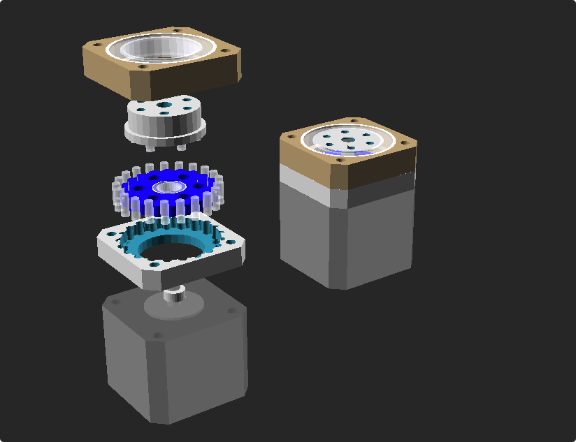

# cycloidal drive design by openscad

openscad open `assem.scad`

this is a simple cycloidal drive, design for 42 stepper, and I want make with 3d print to test this design.

this can play animation in openscad, `View > Animation`, then input FPS and Steps, you can test with FPS 20 and Steps 200, that run.

some file in `model` for export stl file.

some param can change in `param.scad`.

## some parts

|parts|used|
|-|-|
| 3*8mm rollers | for drive rollers and output link |
| 8\*12\*3.5mm bearing | for eccentric rotation |
| 25\*37\*7mm bearing | for output fixed |

## thanks

> design refered [Building a Cycloidal Drive with
SOLIDWORKS](https://blogs.solidworks.com/teacher/wp-content/uploads/sites/3/Building-a-Cycloidal-Drive-with-SOLIDWORKS.pdf)